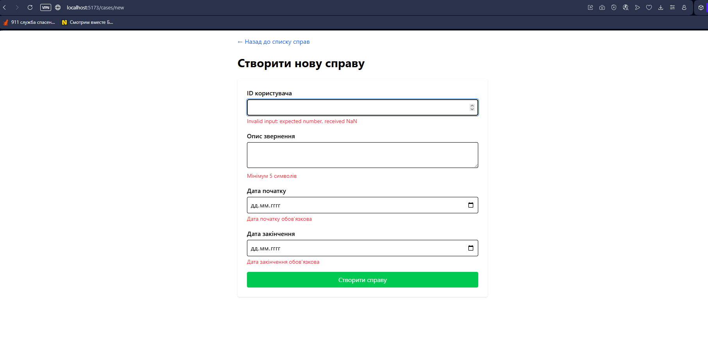
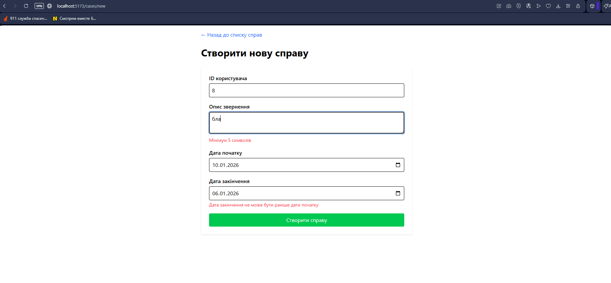

# Vite React Boilerplate

Everything you need to kick off your next Vite + React web app!

## Overview

Built with type safety, scalability, and developer experience in mind.

**Key Technologies:**
- [Vite](https://vitejs.dev) + [React](https://react.dev) + [TypeScript](https://www.typescriptlang.org)
- [TanStack Query](https://tanstack.com/query/latest) - Server state management
- [TanStack Router](https://tanstack.com/router/v1) - Type-safe routing
- [React Hook Form](https://react-hook-form.com) + [Zod](https://zod.dev) - Forms & validation
- [Tailwind CSS](https://tailwindcss.com) - Styling
- [Vitest](https://vitest.dev) + [Playwright](https://playwright.dev) - Testing

## Getting Started

```bash
git clone git@github.com:RicardoValdovinos/vite-react-boilerplate.git
cd vite-react-boilerplate
rm -rf .git
pnpm install
pnpm run setup
```

---

# Lab Report

## Реалізований функціонал

Додаток для управління справами (Cases) з:
- **TanStack Query** - управління серверним станом
- **Axios** - HTTP запити
- **React Hook Form + Zod** - форми та валідація
- **TypeScript** - type-safety

**Функції:**
- Створення справ з валідацією
- Перевірка типів даних, довжини полів, дат
- Бізнес-логіка (дата закінчення ≥ дата початку)

## Ключовий код

### Axios конфігурація

```typescript
// src/lib/axios.ts
import axios from 'axios';

export const apiClient = axios.create({
  baseURL: import.meta.env.VITE_API_URL,
  headers: { 'Content-Type': 'application/json' },
  timeout: 10000,
});

apiClient.interceptors.response.use(
  (response) => response,
  (error) => {
    console.error('API Error:', error);
    return Promise.reject(error);
  }
);
```

### Zod схема валідації

```typescript
// src/features/cases/schemas/case.schema.ts
import { z } from 'zod';

export const caseSchema = z.object({
  userId: z
    .number({ invalid_type_error: 'ID має бути числом' })
    .int().positive(),
  
  description: z
    .string()
    .min(5, 'Мінімум 5 символів')
    .max(500, 'Максимум 500 символів'),
  
  startDate: z
    .string()
    .refine((date) => !isNaN(Date.parse(date)), 'Дата обов\'язкова'),
  
  endDate: z
    .string()
    .refine((date) => !isNaN(Date.parse(date)), 'Дата обов\'язкова'),
})
.refine(
  (data) => new Date(data.endDate) >= new Date(data.startDate),
  {
    message: 'Дата закінчення не може бути раніше дати початку',
    path: ['endDate'],
  }
);

export type CaseFormData = z.infer<typeof caseSchema>;
```

### TanStack Query хуки

```typescript
// src/features/cases/api/cases.api.ts
import { useMutation, useQuery, useQueryClient } from '@tanstack/react-query';
import { apiClient } from '@/lib/axios';

export function useCases() {
  return useQuery({
    queryKey: ['cases'],
    queryFn: async () => {
      const { data } = await apiClient.get('/cases');
      return data;
    },
    staleTime: 5 * 60 * 1000,
  });
}

export function useCreateCase() {
  const queryClient = useQueryClient();

  return useMutation({
    mutationFn: async (caseData) => {
      const { data } = await apiClient.post('/cases', caseData);
      return data;
    },
    onSuccess: () => {
      queryClient.invalidateQueries({ queryKey: ['cases'] });
    },
  });
}
```

### Форма з валідацією

```typescript
// src/features/cases/components/CaseForm.tsx
import { useForm } from 'react-hook-form';
import { zodResolver } from '@hookform/resolvers/zod';
import { caseSchema } from '../schemas/case.schema';

export function CaseForm() {
  const createCase = useCreateCase();
  const { register, handleSubmit, formState: { errors } } = useForm({
    resolver: zodResolver(caseSchema),
  });

  return (
    <form onSubmit={handleSubmit(createCase.mutate)}>
      <input {...register('userId', { valueAsNumber: true })} type="number" />
      {errors.userId && <p>{errors.userId.message}</p>}
      
      <textarea {...register('description')} />
      {errors.description && <p>{errors.description.message}</p>}
      
      <input {...register('startDate')} type="date" />
      {errors.startDate && <p>{errors.startDate.message}</p>}
      
      <input {...register('endDate')} type="date" />
      {errors.endDate && <p>{errors.endDate.message}</p>}
      
      <button type="submit">Створити справу</button>
    </form>
  );
}
```

## Скріншоти

### Множинні помилки валідації


**Демонструє:**
- ID користувача: помилка типу (NaN замість числа)
- Опис: мінімальна довжина < 5 символів
- Дати: обов'язкові поля не заповнені

### Помилка бізнес-логіки


**Демонструє:**
- Cross-field validation через `.refine()`
- Дата закінчення (06.01) < дата початку (10.01)
- Custom валідація з прив'язкою до конкретного поля

## Особливості реалізації

### Структура проекту
```
src/
├── features/cases/
│   ├── api/cases.api.ts      # TanStack Query
│   ├── schemas/case.schema.ts # Zod
│   └── components/CaseForm.tsx
├── lib/
│   ├── axios.ts
│   └── query-client.ts
└── routes/cases/
```

### Ключові рішення

**1. Валідація типів з HTML input**
```typescript
<input {...register('userId', { 
  valueAsNumber: true,
  setValueAs: (v) => v === '' ? undefined : Number(v)
})} />
```

**2. Cross-field validation**
```typescript
.refine(
  (data) => new Date(data.endDate) >= new Date(data.startDate),
  { message: '...', path: ['endDate'] }
)
```

**3. Обробка помилок**
```typescript
const queryClient = new QueryClient({
  defaultOptions: {
    queries: { 
      retry: 3,
      onError: (error) => toast.error(error.message)
    },
  },
});
```

## Проблеми та вирішення

| Проблема | Рішення |
|----------|---------|
| HTML input повертає NaN | `valueAsNumber: true` + `setValueAs` |
| Перевірка залежних полів | Zod `.refine()` з `path` |
| Очистка форми після submit | `reset()` в `onSuccess` |
| Типізація API | Generic types у `useQuery<T>` |

## Висновки

✅ Реалізовано CRUD додаток з:
- TanStack Query для серверного стану
- Zod для type-safe валідації
- React Hook Form для оптимізації форм
- TypeScript для повної типізації

**Навички:** queries/mutations, складна валідація (типи, довжина, бізнес-логіка), error handling, TypeScript best practices.

---

## Report Requirements

* The result of the work must be formatted as a single GitHub repository.
* In the README.md or report.md file, describe:
   * Brief description of the implemented functionality.
   * Examples of key code: Axios configuration, hooks for TanStack Query, Zod schema.
   * Screenshots demonstrating the work:
      * Page with a list of entities (preferably with a loading indicator).
      * Form with validation errors from Zod.
      * Network tab in DevTools confirming real HTTP requests.
      * [Optional] Login page.
   * Comments on implementation features or problems encountered.
